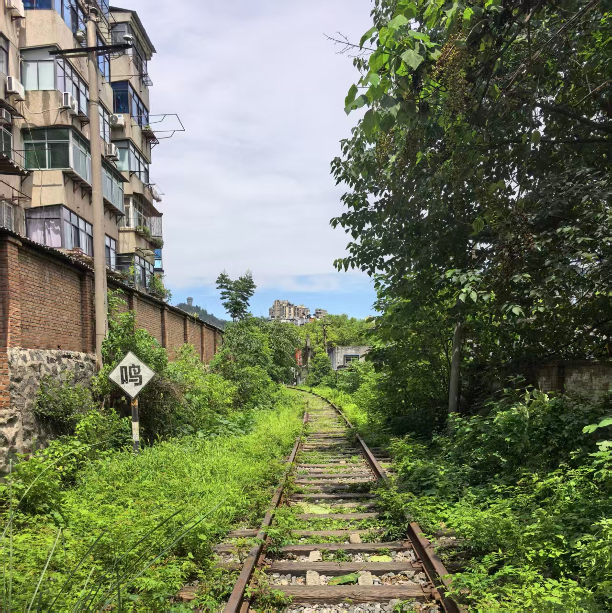
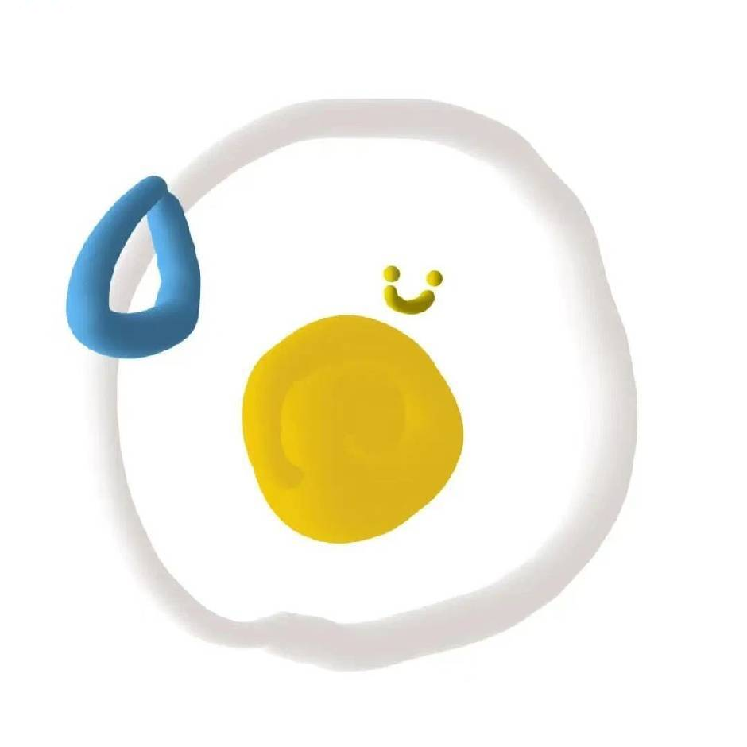
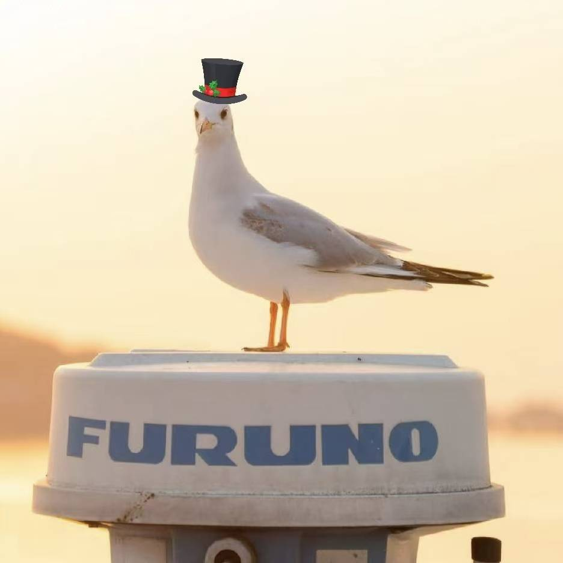

# 贡献者

这份指南由不同同学的经验、整理和维护共同构成。下面记录主要贡献者与对应贡献内容，方便后来者了解每一部分背后是谁在持续推动。

**想一起完善这份指南？**  
欢迎给 [dut-future-guide/dut-future-guide.github.io](https://github.com/dut-future-guide/dut-future-guide.github.io) 提 PR。无论是补充经历、修正错误、更新政策，还是整理一段后来者可能用得上的信息，都会让这份指南变得更可靠一点。

**联系前的小提醒：**  
如果你想添加学长（似乎目前没有学姐，我太区了）的微信，请在好友申请里备注自己的名字，也请尽量确保你已经认真阅读过本指南，对相关内容有自己的思考和具体问题。这样对方更容易判断如何回应，也能让交流真正有价值。

如果你只是单纯想找个人聊聊或者进行一点无害骚扰，可以优先添加刘博文同学的微信，他喜欢被骚扰。

## 贡献者名单

### 涂章正

18720910896（微信同号） zhangzhengtu.github.io 

Project Leader 机器人与具身智能部分 成长经历分享部分

### 刘博文

微信：liubw20050702

ICPC部分 成长经历分享部分

### 赵建斌

微信：dyxxzbb2004

成长经历分享部分

### 幸子杰

微信：creeperLOL

成长经历分享部分

### recynie

微信：ourskylxy   recynie.github.io

成长经历分享部分

### 励逸

微信：Andy256947797

RM篇

### 翟鹏宇

微信：zhai_py

RoboCup 与其他机器人竞赛

### 关中吟

qycqhszt0314@163.com

大二课程

### 草木深

3930648340@qq.com

小挑

### 徐一格

微信：XYGya1021

大一课程

### 李子忆

微信：a2076490958

留学申请部分

### 丛渝轩

微信：Duters2023

成长经历分享部分

### 胡洛铭

微信：Sc_i1ent

成长经历分享部分

### 摆舸

微信：bg121231234

成长经历分享部分

### 木

微信：dkmTXWD

成长经历分享部分

### 王俊博

微信：Wovoey__0411

成长经历分享部分

