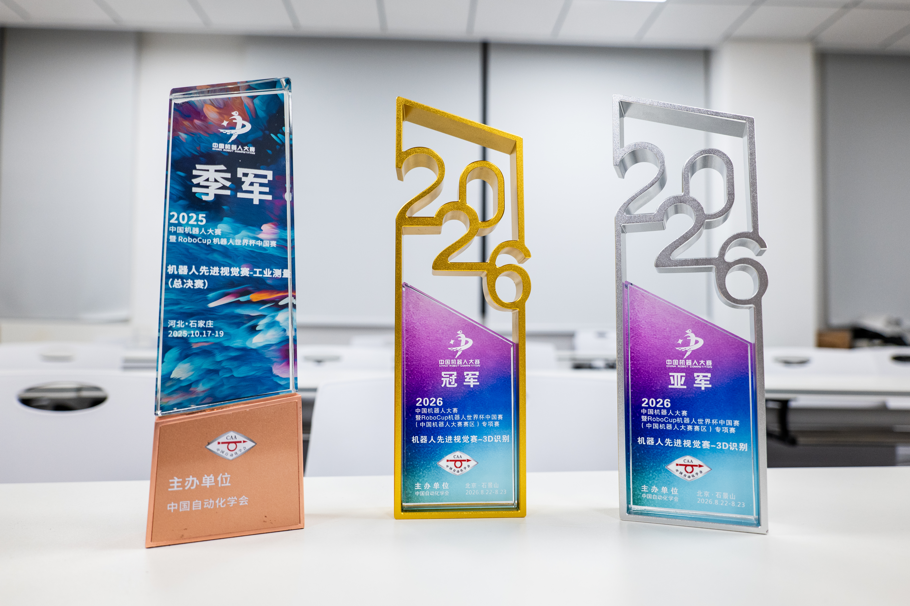
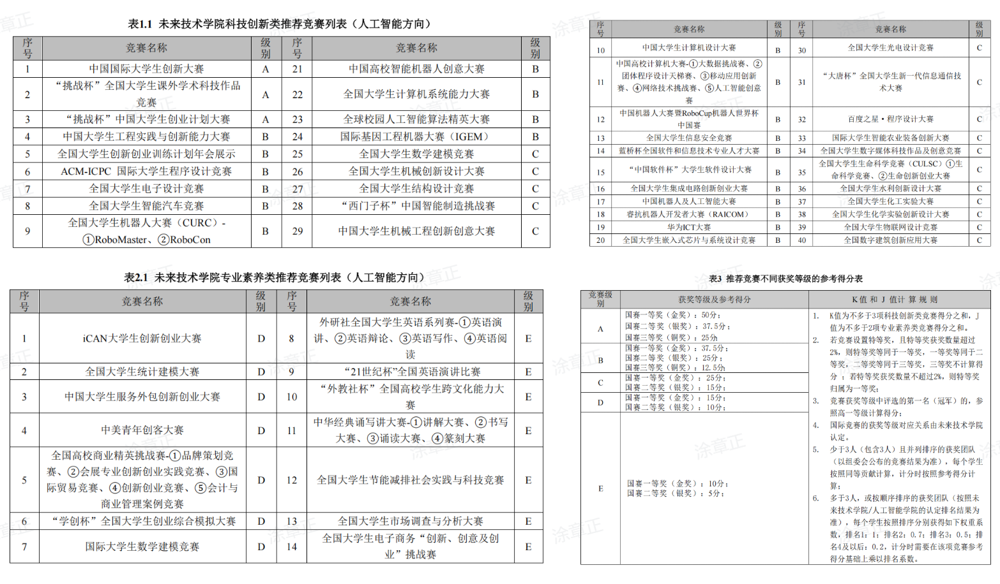
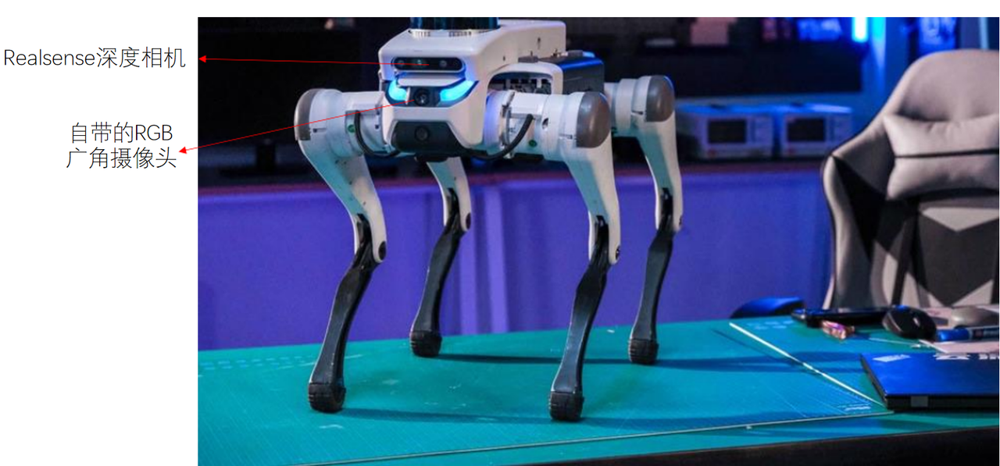
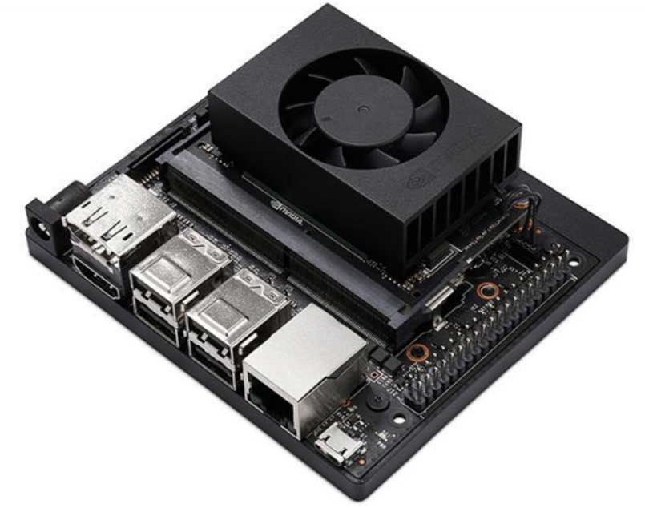
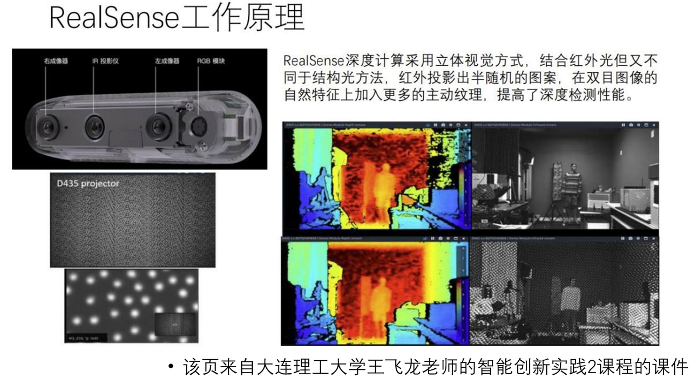

# RoboCup 与其他机器人竞赛

<p class="guide-lead">
机器人竞赛看起来像是 Linux、ROS、SLAM、OpenCV、深度学习、嵌入式、电控、机械臂……什么都要会；但真正开始做之后你会发现，绝大多数知识都不是“学完了才能参赛”，而是在解决一个个具体问题的过程中学会的。
</p>

## 写在前面：机器人竞赛到底在做什么

如果你第一次接触 RoboCup、智能机器人创意大赛、睿抗、高校机器人比赛或者其他机器人竞赛，很容易被各种名词劝退：ROS、SLAM、RealSense、奥比中光、YOLO、PID、Jetson、单片机、机械臂……好像必须先学成一个“全栈机器人专家”，才有资格碰机器人。

其实完全不是这样。

抛开不同比赛的规则差异，大多数任务型机器人竞赛，归根结底都可以拆成三个最基本的部分：**感知、规划、控制**。

### 1. 感知：先让机器人“看见”这个世界

机器人首先需要知道周围发生了什么。

本科阶段的机器人竞赛里，最常见的传感器还是各种摄像头。很多队伍会使用普通 RGB 相机，也经常会见到 **Intel RealSense、奥比中光（Orbbec）** 这样的 RGB-D 深度相机。

但并不是用了深度相机，就一定要把深度信息全都用上。很多比赛的任务其实只靠 RGB 图像就能够完成，比如颜色识别、目标检测、二维码识别、仪表盘识别、巡线、手势识别等；只有在测距、三维定位、机械臂抓取、复杂避障等任务中，深度信息才会变得更加重要。

所以“感知”听起来很大，真正落到比赛里，经常就是：

```text
摄像头输入
    ↓
OpenCV / YOLO / 其他视觉模型
    ↓
得到目标类别、位置、距离或状态
```

你不需要一上来就会最前沿的视觉算法。很多任务甚至用几个 OpenCV 操作就可以解决；真正复杂的时候，再去训练检测、分类或分割模型（其实训起来也很简单）。

### 2. 规划：决定机器人“下一步做什么”

机器人看见环境之后，就需要决定下一步行动。

大部分比赛中，由于环境是结构化的确定的，规划其实并不复杂，大部分是：

```text
看到起点
  ↓
沿线前进
  ↓
识别目标
  ↓
转向目标
  ↓
靠近目标
  ↓
完成抓取
```

复杂一些时，才会涉及定位、建图、全局路径规划、局部避障等问题。

这里经常会接触到 **ROS**。ROS 是机器人软件系统中的通信框架和基础设施：相机、雷达、定位模块、规划模块和底盘控制模块可以通过 ROS 的 Topic、Service、Action 等机制互相传递信息；而 SLAM、定位、路径规划、导航等功能，也已经有很多成熟的开源组件可以直接使用（会用 ROS 你就可以成为调包侠）。

所以本科竞赛里非常常见的一种工作方式就是：**不要重复造轮子，而是把已有模块真正接起来、跑起来、调稳定。**

### 3. 控制：让机器人真的“动起来”

规划最终一定要变成真实世界里的运动。

如果你使用的是宇树、云深处等已经提供完整运动接口的成品机器人，很多时候并不需要自己从零控制每一个电机，只需要发送速度、角速度、姿态或者步态等高层指令即可。

如果比赛要求自己搭机器人，那么才会进一步涉及电机、驱动器、单片机、编码器、PID、电源、电路和嵌入式开发等内容。

因此机器人竞赛也很适合组队：有人负责机械，有人负责视觉和算法，有人负责 ROS 与系统，有人负责电控和嵌入式，大家最后把模块整合起来。

## AI 时代，机器人竞赛的门槛其实正在快速降低

如果在几年前开始做机器人，最痛苦的事情之一往往不是算法本身，而是：环境配不起来、库版本冲突、ROS 消息看不懂、一个报错搜半天、英文文档读不明白、代码不知道从哪里改。

而现在有了越来越强的 AI，这些问题的学习成本已经低了很多。

你完全可以让 AI 帮你解释一段 ROS 代码、分析编译错误、写一个 OpenCV 原型、给出 PID 调参思路、解释坐标系转换等等。过去可能要查半天博客的问题，现在很可能十分钟就能找到方向。

所以我越来越觉得：**机器人竞赛真正的门槛已经不再是“你现在会不会”，而是“你愿不愿意真的去做”。**

因为机器人和纯软件项目最大的区别在于，它最终必须面对真实世界。

光照会变，摄像头会掉线，USB 会松，深度相机会失效，电机会过热，坐标系会搞反，网络会丢包，比赛现场和实验室环境不会完全一样，昨天还能跑的程序今天可能突然报错。AI 可以告诉你知识，却不能替你经历这些真实系统里的问题。

而这些问题恰恰也是机器人竞赛最有价值的地方。

因此，如果你问我机器人竞赛最重要的前置知识是什么，我觉得：**Linux 和 Python/C++ 学一点，找一场比赛、一个实验室或者一台机器人，然后直接开始做。缺什么，再学什么。**

现在资料很多，AI 也足够强，绝大多数本科竞赛中的技术问题最终都能被学会。真正稀缺的是实践、耐心，以及把一个真实系统从“完全不能跑”调到“稳定完成任务”的经历。

<div class="lab-ad" markdown>

插播一条广告：
笔者大一就进入创院加入深度信息实验室，位于创新创业学院523，指导老师是姚翠莉老师（老师人特别特别随和，从不压力，一直默默支持而且还会给核心成员发点福利），我们是一个很小的实验室，每一届的核心成员只有1到2名，专注于 RoboCup 先进视觉赛道（如果你愿意参加其他比赛姚老师也是大力支持只要不是太水）。从我大一那年的国三，到大二带着大一学弟拿下一个国一和一个季军（主力是学弟，我主要起的作用是带入门且微微push，因为实验室需要传承，而核心技术传递之后就需要竞赛负责人不断的精进），再到今年，纯血大一学弟组成的队伍在全国专项赛包揽了冠军和亚军，我想我们实验室能算得上是建设起来了一个还不错的梯队和内部的竞赛经验。



所以，如果你对这个竞赛有兴趣，你可以联系姚老师，也可以在选课时选修一下创院我们实验室开设的课程，也欢迎来线下真实（最好自己提前了解并带着问题来），虽然我可能不常在实验室了要去上海提前进组当牛马，但你可以薅着现在大二的核心成员咨询（礼貌一点），我也可能突然在实验室刷新（如果我还在DUT的话，你也可以和我聊具身智能）

</div>

下面是 **翟鹏宇** 的分享，他从自己进入大学的感受出发，到参加四足机器人比赛的经历，具体分享了机器人竞赛到底需要学什么、项目是怎样搭起来的，以及一场比赛从预赛到国赛究竟是什么体验。

为适配本站阅读，我只对 Markdown 层级、少量错别字与排版进行了整理，尽量保留原文的表达方式与观点。

**原始文章：** [飞书文档](https://ncndbcaj2iil.feishu.cn/wiki/RT4kw09Uvi6qT4kg8RdcdxzgnXe)

## 路就在脚下——我的机器人竞赛经历

### 1. 路就在脚下

Hello 啊各位新加入大工的小登们，承蒙邀约，在此执笔，写下我本科摸索出来的一点点小经验。

作为江苏南京人，我也是成功在内卷的大环境中被南京拒之门外，阴差阳错之中来到了大工。说实话，初入校园的时候并没有像我高中幻想的那样兴奋，更多的还是心有不甘，所以我从大一就想着保回南京，也得益于未来技术学院的高保研率，让我这个想法有了一个基本的保障。

但保研到底要做什么？该走哪条路才能到达心中那个理想的地方？我想这可能是你们或者绝大多数刚入学的同学最困惑的地方。

有句话说得好，“大学就像荒野，不管向哪走，都是前进”（实则具体怎么说的已经忘了，但我入学自我介绍说的就是这句话）。不管你们现在是否还困惑、不解、犹豫不决，这都是太正常不过的现象。

就以我的亲身经历来说，大一我也只是认为好好学习、搞好绩点就够了（**搞好绩点确实非常重要！非常非常非常重要！！！**），所以我只是好好上课、好好写作业。但我当时时常在想：这真的是我想过的大学生活吗？我学的这些真的有用吗？

于是，在大一结束的寒假，我做了令我至今觉得最重要的决定——**跳出舒适圈。**

我联系了创新创业学院的刘胜蓝老师（啊，我的恩师），希望能够加入他的实验室学习。其实我一开始这么想并不是非常功利地说要打比赛加分，甚至我当时连保研规则都没有摸清。我只是想要这么做，我想要学我能用到的知识，我想做点东西出来，我不想再困在应试教育里了。

如此，我来到了可以说改变我整个本科的地方——**创新创业学院**（创院真的太太太 nice 了，这里的老师、同学，一切的一切都是我大学期间最最宝贵的回忆）。

总之，掰扯了这么多，我想说的就只有——走起来，行动起来，不要因为看不到终点就踌躇不前。

各位后辈们，切记：**路就在脚下！**

### 2. 在创院圆梦——我与竞赛的那些事

#### 2.1 有什么竞赛

各位刚进入大学肯定会非常迷茫，这时候作为老学长就必须给你们指出一件刚入学越早做越好的事情了——**翻学院官网文件。**

你们要知道，大学其实很多时候打的是信息差而非真正的实力。尤其是在大家都刚刚进入新环境、不知道该做什么的时候，提前掌握信息及渠道的人就相当于掌握了主动权，赢在了起跑线。

而大学又不像中学那样只围绕学习，每天都会有围绕各种各样事情的通知发布。精准地抓住哪些是你想了解的、哪些是你希望投入的、哪些又是你看都不用看的，这也是一种能力。

未来技术学院应该会在你们刚入学的时候就发布保研相关的推免政策（如果大一不发，请一定自己去官网扒或者问往届学长要），趁早摸清保研的加分项。

**综排真的能力挽狂澜。**

就拿我们这届来说，我们人工智能专业的学排前几和总排前几就没有重复的，说明学排不高的人真的可以靠综排来到本来可能到不了的位置。

以我们这一届的规则为例，综排 100 分中 85 分是绩点，5 分是奖学金，剩下的 10 分包括竞赛、科研、英语、本研衔接等等，其中竞赛占到了整整 5 分。竞赛因此也是综排弯道超车非常直接的方式之一。

!!! warning "规则一定以你所在届次的最新文件为准"
    推免、综排、竞赛分类和不同位次的加分规则都可能调整。下面关于 A/B/C/D/E 类竞赛及加分系数的描述，是作者所在届次和专业的实际经验，不要直接拿来套用你这一届的政策。

那究竟有什么比赛可以参加呢？哪些比赛有含金量，哪些比赛相对更容易出成绩呢？

别急，请看下图：



因为本人是人工智能专业，所以我就拿我们专业的竞赛榜单为例。

榜单竞赛总共分为 A、B、C、D、E 类，等级越高加分越高。不同等级竞赛加分不同，不同位次实际上也不同：**一号位也就是队长加分系数为 1，二号位 0.7，三号位 0.5，四号位及以后 0.2。**所以别想着挂名混就能加满，除非你能抱上愿意挂你二号位的大腿。（但是像数模、电赛、智能车这种官方承认共一的，就都按系数 1 来算，不存在位次。）

- **A 类竞赛**：比如挑战杯、互联网+。一号位国一就可以直接加满 5 分。当然这种 PPT 大赛除非抱大腿，不然想凭自己做、没关系没背景的还是尽早放弃吧……
- **重点关注 B 类竞赛**：这也是绝大多数竞赛加满的人集中参加的部分。国一一号位就可以加 3.75 分，意味着你只要再拿个 B 类国三一号位或者 C 类国二一号位就能加满。B 类竞赛中也有区分，算法大佬可以直接打 ACM、ICPC；想简单点混奖的也可以参加计算机设计大赛、蓝桥杯的一些赛道等。还有一大类也就是机器人类的比赛：RoboCup、睿抗、高校机器人等等。这些机器人比赛相对一些 PPT 比赛难度更高，但真的涨技术，因为机器人比赛大多不好混，都是靠自己真刀真枪干出来的。
- **C 类竞赛**：相对来说加分少一些，可以作为最后加不满的时候的备选。
- **D/E 类竞赛**：一些其余的比赛，同样可以作为加不满的时候冲分用。

机器人比赛中也有**开放式**和**任务式**两种。

开放式一般给定一个主题，然后组队设计机器人。好处是没有题目限制，可以充分发挥想象力；缺点是评分主观因素更大，评委的判断很有可能让你从国一掉到国二，拿不拿得到奖并不完全由你掌握。

而任务类比赛的主观性会大大减少，因为是给定任务，所以一般采取打分制：完成不同子任务给定不同分值，最后按总分数加技术报告完成情况进行排名。相对来说客观很多，但因为大家都是做同样的任务，所以基本都是奔着满分做才有可能国一，竞争相当激烈。

#### 2.2 你需要什么（机器人比赛为主）

其实机器人比赛需要的知识相当多，所以会让很多新生望而却步，但实际上只要你掌握了：

> Linux 基础命令、Python/C++ 编程、计算机网络、计算机组成原理、高等数学、线性代数、ROS 通信、SLAM 导航、CMake 编译、OpenCV、PID 控制、单片机、嵌入式理论、强化学习、边缘设备部署、Jetson 开发板应用……

你就可以来做机器人了。

**开个玩笑。**

实则很少有全栈工程师能软硬兼吃。作为本科生，一般来说专攻软或者专攻硬，在打比赛的时候相互配合，就可以产生很好的化学反应。

我本人就偏软，所以嵌入式相关的我一点不会，但这也不影响我竞赛加满。所以大家也不必太过焦虑，打机器人比赛更多的还是**边做边学**。你也不知道在打比赛的时候会遇到什么问题，所以不要害怕学习新知识，而是要把它当作你解决困难理所应当的一步就好了。

我参加的比赛主要是**中国高校智能机器人创意大赛**，而我们实验室又有宇树与云深处的成品机器狗，所以我本科期间基本都是在做机器狗相关的比赛及项目。

就拿我参加的中国高校智能机器人创意大赛四足专项赛来说，当时的任务其实还是偏 CV、感知的。而且由于我们是用成品狗进行二次开发，所以其实不太需要嵌入式那些硬件知识，更多的是算法部署、环境配置的问题。

不过抛开这些理论，我认为你们最需要的还是**坚持**。

我在实验室待了那么久，也见过两三届新生了。很多人都是刚开始兴致勃勃地加入进来，结果没几周基本就销声匿迹了。因为一开始做大概率什么也不会、无从下手，所以很容易产生放弃的想法。

但是只有坚持下来的人才能学到真东西，才有可能拿奖。所以如果你们刚开始打比赛发现什么也不会，那请千万不要放弃，而是去学，去弥补你不会的地方。就算这次比赛没成功，你学到的东西也会在后续的日子里给予你极高的回报。

!!! tip "一个额外收益"
    打比赛很多时候会提前学到课内的东西。如果你在正式上这门课之前，通过打比赛已经实际用过一遍，到时候上课就是温故而知新，绩点往往也不会低。

### 3. 四足机器人比赛经验

因为刘胜蓝老师实验室有很多四足机器人，当然现在也有人形机器人，所以参加一些指定成品机器人的比赛是比较方便的。

我本人就是使用**云深处绝影 Lite3** 机器狗参加的第八届中国高校智能机器人创意大赛四足专项赛。那参加四足相关的比赛，具体需要学些什么呢？

总的来说可以有以下部分：

- 基础的 Linux 系统命令，Python 或 C++ 编程语言；
- 对 CMake 编译有一些了解，有些库很可能会用到源码编译；
- 掌握视觉的一些处理方法，传统方法主要靠 OpenCV 的封装，深度学习框架需要使用到 PyTorch，要会跑 YOLO，以及 TensorRT 部署；
- 掌握基础的 PID 思想；
- 机器人操作系统 ROS，只需要先学习几种通信方式即可（因为接受一些机器狗返回的信息以及发送指令给机器狗都需要 ROS 接口）；
- 如果竞赛任务中有机械臂任务：机械臂制作、机械臂解算（迭代法或者调库）与机械臂控制（电控）。

本次介绍以绝影 Lite3 及竞赛为例。



整体的软件架构为：

```text
感知输入：RGB、RGB-D 等
        ↓  （OpenCV、RealSense SDK）
Jetson 计算设备，运行你的代码
        ↓  （ROS 通信接口）
让机器狗怎么走
（沿 x/y 轴线速度、绕 z 轴角速度，以及使用什么步态）
```

#### 3.1 计算设备介绍

Jetson 设备是由 NVIDIA 推出的一系列高性能、低功耗的嵌入式计算平台，专为边缘计算、深度学习和计算机视觉等 AI 应用设计。



- 与普通 PC 常见的 x86 架构不同，云深处机器狗上的 Jetson 使用 ARM 架构，所以会发现很多库难以安装（使用 C++、CMake 开发的大佬基本可以无视该问题）。如果使用 Python 开发，`pip` 直接装不上的库一般需要搜索教程，根据具体环境进行源码编译安装。
- Jetson 可以简单理解为带有 CUDA 核心的 ARM 架构设备，也即可以进行深度学习模型推理的“树莓派”，当然价格也是 CUDA + 树莓派。
- 绝影的 Jetson 自带镜像中可能已经预装 JetPack，也即已经配置好 CUDA、cuDNN、不加 CUDA 编译的 OpenCV 等视觉与深度学习常用库。如果已经预装 JetPack，CUDA、OpenCV 等无需自行安装，但可能需要添加 CUDA 相关环境变量。
- 个人建议 Python 使用系统自带 Python3 进行开发即可，安装库直接装在系统 Python3 下，尽量不要安装 Conda 系列进行环境管理：一是竞赛任务所需的库版本可能没有管理多个环境的强需求；二是 Conda 可能覆盖环境，容易出现问题。如果真的想要安装 Conda，可以安装 Miniconda，不要装官方 Anaconda——别问，问就是血淋淋的教训。

#### 3.2 感知部分

##### 普通 RGB 摄像头

- 普通 USB 接口的 RGB 摄像头图像读取，包括 Lite2 的广角相机与外加的 USB 相机，一般使用 OpenCV 的 `VideoCapture()` 读取即可。
- Lite3 的 RGB 相机好像接在了运动主机上，想要使用感知主机也即 Jetson 设备读取需要推流，比较麻烦且帧率不高，建议直接外挂 RGB 摄像头。
- OpenCV 在 Jetson 设备上带 CUDA 的源码编译可参考项目：[DeepRobotDog](https://github.com/OpenCVChina/DeepRobotDog)。但如果不使用 OpenCV 部署网络模型，通常用 JetPack 自带的 OpenCV 就够了。

##### RealSense D435i 深度相机

除了 RGB 图像外，RealSense D435i 还能读取 Depth 深度图，通过处理可以得到 RGB 图像中像素对应的深度信息，所以也叫 RGB-D 相机。

使用 RealSense 需要安装官方 SDK，也即 `librealsense` 库：

[librealsense releases](https://github.com/IntelRealSense/librealsense/releases)

Python 接口需要在编译时指定 Python wrapper，Python 中这个库的名字叫做 `pyrealsense2`。



一些实际使用经验：

- RealSense D435i 通过主动红外与双目深度感知获得深度信息。需要注意，深度图中的值通常表达的是该三维点沿相机成像方向的深度，而不是简单理解为“到相机光心的欧氏距离”。
- 室外强光、尤其是太阳光中的红外成分，会对主动红外深度方案产生干扰，因此 D435i 在室外或复杂红外环境中的深度质量可能明显下降。
- D435i 型号中的 `i` 代表内置 IMU，可以读取加速度与角速度信息。在静止状态下可以读取重力在三轴的分量，进而估计深度相机安装的俯仰角等姿态信息。

#### 3.3 视觉处理

##### 传统方法

常用的视觉处理传统方法，OpenCV 基本都已经实现，无需重复造轮子。

常见方法包括：

- HSV 色彩空间过滤颜色；
- 边缘检测；
- 轮廓检测；
- 二值化、灰度化；
- 霍夫变换圆形检测；
- 仿射变换；
- 开闭运算；
- 直方图均衡化等。

建议大家在遇到需要解决的问题时，直接问 AI 或搜索“如何使用 OpenCV 实现某功能”，先把原型快速跑出来。

比如比赛中的巡线：在绿色背景上提取白色的线，完全可以在 HSV 色彩空间下过滤掉绿色草地背景，然后对剩余部分通过一些方式滤波，最后求取最大连通区域，把它作为循迹线。

##### 深度学习方法

深度学习方法的优势体现在：只要数据集采得好，图像分类、目标检测等视觉任务的鲁棒性往往会很高，且无需像传统方法一样针对大量阈值反复调参。

竞赛中常用的视觉处理任务与方法有：

- **图像分类**：ResNet 等分类网络；
- **目标检测**：YOLO 系列、Faster R-CNN 等；
- **图像分割**：YOLO 分割模型等。

比如手势识别，可以直接使用目标检测方法处理，也可以使用一些骨骼点提取网络（如 [MediaPipe](https://github.com/google-ai-edge/mediapipe)），得到骨骼点坐标后，再自己搭建简单的全连接网络进行分类。

##### 模型部署

- **直接 PyTorch 部署**：需要在 Jetson 上安装 PyTorch，使用方便，但推理速度一般。教程可参考 [NVIDIA 官方论坛](https://forums.developer.nvidia.com/t/pytorch-for-jetson/72048)。
- **TensorFlow / TFLite 部署**：我没怎么用过，但也可以作为轻量化部署方案。
- **OpenCV DNN 部署**：把训练好的模型转化为 ONNX，利用 OpenCV 的 DNN 模块读取 ONNX 模型即可推理。优点是无需安装太多其他库，部署相对方便；如果 OpenCV 带 CUDA，速度也能进一步提升。
- **TensorRT 部署**：JetPack 中通常已经包含 TensorRT，推理速度很快，但需要把模型转换并在 Jetson 上生成 engine 文件，使用起来会麻烦一些。可以参考开源项目 TensorRTx，其中实现了许多常用深度学习模型的 TensorRT 部署。

#### 3.4 四足机器人高层控制

控制接口通常有两种：

1. **底层控制**：直接控制各个电机；
2. **高层控制**：直接控制机体速度、方向、姿态、步态等。

对于大多数使用成品四足机器人的竞赛任务，通常使用高层控制就足够了。

一种方式是直接使用机器狗厂商提供的网络通信接口：查询文档，按照文档向指定 IP 与端口发送指令。例如：

```python
def _set_x_speed(self, x):
    if x > 0:
        self.send(struct.pack('<3i', 0x21010130, int(6553 + x * 2621), 0))
    elif x < 0:
        self.send(struct.pack('<3i', 0x21010130, int(-6553 + x * 2621), 0))
```

另一种方式是使用 **ROS 接口**。例如直接向 `cmd_vel` 话题发送速度指令，调用方便，并且更容易和上层感知、规划模块衔接。

ROS 学习教程可参考：

[ROS 学习教程](https://www.bilibili.com/video/BV1Ci4y1L7ZZ/)

对于比赛入门来说，ROS 最核心的还是**通信机制**。先把 Topic、Service 等基本通信方式弄懂，就已经可以解决相当多的问题，没必要一开始就把整个 ROS 生态全部学完。

#### 3.5 四足机器人定位与控制方法

由于当时的比赛禁用了激光雷达，因此如果想使用 SLAM 方法进行定位，只能考虑视觉 SLAM，例如 VINS 系列与 ORB-SLAM2。

不过使用视觉 SLAM 定位比较复杂。在结构简单、规则明确的赛场中，也可以采用更加工程化的方法，例如：**循迹 + 视觉矫正**。

循迹可以在识别出循迹线位置后，使用循迹线距离图像中间的误差进行 PID 控制。

视觉矫正则可以通过识别多个已知物体实现：由于很多物体在赛场中的真实三维坐标是已知的，通过视觉观测与几何解算，可以反推出机器人自身的位置或姿态。

#### 3.6 机械臂抓取

机械臂抓取任务可以通过较精确的三维解算实现，基本可以拆成几步：

1. 靠近待抓取物体；
2. 识别物体，并获得待抓取物体在相机坐标系下的三维坐标；
3. 将该坐标转换为机械臂坐标系下的三维坐标；
4. 通过机械臂逆运动学解算出各关节角度；
5. 控制机械臂完成抓取。

三维坐标的获取往往是任务中比较难的一部分。

由于 RealSense 在绝影系列上的安装角度略微朝下，很难直接识别并获取某些待抓取物体的三维坐标。如果团队资金充足，可以外挂新的深度相机；也可以使用双目相机，通过特征匹配与视差估计计算深度（OpenCV 的 SGBM 就是一种传统双目匹配方法）；再简单一些，也可以使用单目相机，根据目标的成像大小等先验信息做近似估计。

机械臂解算方面：

- 机械臂逆运动学的解析解需要满足一定结构条件，因此这里不展开；
- 也可以通过梯度下降等数值优化方法实现逆运动学，把机械臂末端三维坐标与目标三维坐标的二范数（欧氏距离）作为代价函数，优化参数为机械臂各个可旋转关节的角度。具体计算梯度时甚至可以使用 PyTorch 自动微分——PyTorch 不只可以做深度学习；
- 当然也可以直接寻找现成的机械臂逆运动学库，比如 `ikpy`。

### 4. 令我难忘的一次经历

大部分保研人冲竞赛分都是在大二和大三上的阶段，所以大二时期真是我打比赛最狂热的时期，也是最容易加满分的时期。

还记得我当时第一次打四足比赛，参加的是中国高校智能机器人创意大赛。在此之前，我一次都没有用过机器狗，所以对我来说真是一次全新的体验。

#### 4.1 预赛

预赛三月报名，七月才出结果，可以说周期非常长。

而预赛的任务其实并不难：通过摄像头识别仪表盘状态并在终端输出结果，它甚至不要求必须部署到机器狗上。

其实我们很快就在本地电脑上实现了。先通过霍夫变换检测圆，再二值化灰度图提取指针位置，进一步提取指针与圆边界交点附近的颜色进行 RGB 识别。

但是难点在于：**怎么将算法部署到狗子上。**

因为实验室的狗内置开发板搭载的是 Ubuntu 18.04 的古早版本，导致很多本地能直接 `pip` 的包在该系统上都会有各种各样的版本冲突问题。雪上加霜的是，这还是 ARM 架构的 Jetson NX，而非 x86，这就更加难用了。

所以我们一开始花了一个月的时间在配置环境与协调包和包的版本上，甚至很多包都得手动源码编译，比如 OpenCV。

所幸我们在五月就早早完成了部署，而且微调过后的检测效果也出奇地好。理论上接下来写写报告，预赛就结束了。

但往往不出意外的时候，就要出意外了……

因为当时也快到期末了，所以我们做完后就没有再管狗子，开始专心备考期末。等到期末结束，官方也发布了具体的提交报告与演示视频细节，我们准备直接拍完视频就提交。

但是我们惊讶地发现：**狗子莫名其妙丢包了。**

可能这就是 Linux 吧，期间根本没有人动过它，总之就是原本能运行的程序运行不了了，报了各种各样奇怪的错误，导致我们又急头白脸地修 Bug。好在最后也成功解决了。

但是都说祸不单行，当软件问题解决的时候，意味着硬件该出问题了……

因为我们都不喜欢拔掉 SIM 卡再开狗子背上的盖子，导致插 SIM 卡的卡槽越来越松动（其实我感觉云深处本身这块就没加固，线下比赛碰到好几个队都遇到过这情况），最终也是不负众望地掉了。

我们只能又把狗子寄回官方维修，同时 SIM 卡也得重刷。这意味着我们会浪费两周时间维修，而且返修回来的狗子只有一个重装的系统，我们还得从头配环境、测程序。

这真的很劝退啊魂淡。

但是我们也都坚持下来了，最后以省一前几名的成绩晋级国赛。

#### 4.2 国赛

经历过预赛的波折之后，国赛更是重量级。

首先，在提交预赛作品之后到国赛只剩一个月，而出预赛结果又是在提交作品后一周。也就是说，当真正知道自己晋级国赛时，到线下比赛只剩二十天左右。

这肯定是远远不够的，尤其国赛任务又臭又长，还要考虑购买材料、搭场地的时间。

所以我们当时梭哈了一把：**我们赌自己一定能进国赛，所以做完预赛任务后直接开始准备国赛。**

为什么敢这么自信？因为我们按照打分表把任务的得分项全做满了，也就是说，理论上看任务完成度就是满分。

所以这也是为什么我之前告诉你们：任务型机器人比赛，一定要尽量冲着满分标准去做。

国赛任务总共分为三个阶段：**巡检——救援——抓取**。

整个比赛场地是约 3×9 的场地。最右边是巡检区域，一共有三个纸箱，在正反面都贴有预赛要求识别的仪表盘，分为“偏低”“正常”“偏高”三种状态。

机器狗需要自动检测六个仪表盘，并且识别仪表盘上方的数字以及锥桶颜色，根据识别结果进行实时语音播报，同时做出点头或摇头的动作。

第一阶段完成之后进入中间的救援部分。四个角对应四种颜色的小球，机器狗需要根据第一阶段巡检的结果，识别出与第一阶段状态异常仪表盘上方锥桶颜色相同的小球并踢球，踢出白圈获得全部分。

最后是最左边的机械臂抓取部分：需要机器狗自主识别台面上的物体，将目标物体抓离台面，并放置到旁边的空箱子内。

对比一下预赛和国赛的任务量，不难发现国赛可谓时间紧、任务重。所以一定要提前准备，除非你的技术真的非常厉害。

就这样，我们在创院四楼仓库收拾出了一片区域来搭场地（现在仓库已经被学院改成教室了，当时因为工训中心有事不能占用，所以只能在仓库做），然后开启了在仓库日均 **8–10 小时调狗子** 的生活。

持续了一个月左右，任务也基本都实现了。

回想起来，真的是一段非常特别的经历。仓库也没有椅子，我们就一人抱着一台电脑，在场地边上席地而坐，一调就是一整天；经常为了改一个 Bug 花费一两天时间。

从任务拆分、细化、优化再到整合，每一步都是我和队员一点一点克服的。

其实回头再看，要说任务真的多难吗？实则也并非如此。更何况现在的 AI 已经比我们那时候又要强上太多了，所以技术上的难题终究可以被克服。

我认为最重要、也是决定你能不能拿到国奖的，还是你的**坚持与意志**。

没有一帆风顺的国一。遇到 Bug 和挫折的时候能不能坚持下去，才是最重要的。

#### 4.3 现场

国赛前一天，主办方允许我们去比赛场地调一天狗子。

那一天真是太极限了……

因为视觉识别中用了大量 RGB 识别，从普通 RGB 摄像头到 RealSense，它们的弊端都非常明显：**对光照环境敏感。**

而显然主办方也知道这一点，所以才会让我们提前一天去现场调试。

我们也不出意外地再次出现了意外。

原本在自己学校场地测试时三个阶段任务都可以完成，结果到了比赛场地，连第一阶段任务都完成不了。

距离正赛只有一天时间了。

我们在比赛场地从头开始拍摄数据集、模型训练、模型部署。已经忘记了时间，从早上九点一直调到晚上九点场馆关门，最终也只是把前两个阶段稳定实现了。

如果说**坚持**决定你能不能拿到国奖，那**临场应变能力**就是决定你能不能拿国一。

在现场遇到各种问题，在短时间内想出解决办法并迅速解决——如果不是你一直参与的项目，肯定连怎么改都不知道，所以想混比赛无疑是没戏的。

而因为我从预赛到国赛基本都是编程主手，所以对于每一阶段、每一部分会有什么问题，出问题怎么解决都很熟悉，才能在一天时间内调试到接近我们在校内的水平。

到了第二天正赛的时候，每个队只有两次机会。

我们的狗在第一次出发识别完一个仪表盘后就出问题了。所幸我早在学校调狗子的时候就遇到过这个问题——**USB 摄像头连接断了。**

所以我才能立刻修复，然后在第二次机会中成功执行。

最终，我们也是拿下了**国一**，悬着的心终于放了下来。

当然，我也参加过很多其他比赛，也拿到过很多奖项，但只有这次让我印象非常深刻。

可能只有当你们真正为了一件事倾注所有并学有所得的时候，才能体会到那种成长的感觉。

这就是我希望的大学应该有的感受。

### 5. 工欲善其事——AI 时代如何做项目

都说工欲善其事，必先利其器。那么在当今 AI 盛行的时代，显然我们都无法避免需要用到或者借助 AI 的力量（在此纪念手搓时代的落幕）。

实则在我这届的上一届开始，大家就已经渐渐从纯手搓转向借助 AI 写代码了。可能大家或多或少会对此抱有不安甚至怀疑：**我用 AI 写代码做项目，真的是我的实力吗？**

其实我以及身处这样一个时代的每个人都会有这样的疑问。

但经过这几年的实际体验和对身边人的观察来看，我认为这只是我们拥抱时代的一种方式。对于我们这种需要与计算机、AI 打交道的专业来说，使用 AI 已经是家常便饭；但真正能不能把 AI 用对、用好，依然是能力的一部分。

现在的 AI 发展速度相当惊人。可能各位刚从高中的卷面考试教育阶段上来，对 AI 的发展还没有一个很前沿的认识，对什么是大模型、Agent、MCP、Skill、Plugin……这些概念都一头雾水。

可以先用一个很粗糙但容易理解的方式去认识：大模型像“头脑”，外接工具和能力以后，它就不再只是一个聊天框，而可以读取文件、调用代码、搜索资料、修改工程、执行命令，逐步成为一个能够替你完成一部分操作流程的 Agent。

所以现在做项目时，完全没必要把“必须全部手敲”当成能力证明。让 AI 帮你查 API、解释代码、搭工程框架、分析报错，都没有问题。

但借助 AI **不代表完全依靠 AI**。

该学的理论还是得学。不然你连 AI 在做什么、为什么这么改、这个结果是否合理都看不懂，那就和把自己的项目完全交给一个陌生人没有本质区别。

始终要记得：**最终决策权还是得牢牢掌握在自己手中。**

### 6. 结语

说了这么多，听上去挺唬人，其实只是因为我将我三年的经验一下子全部倾倒进你们脑中，带来了总观上的恐惧罢了。

所以也别想这么多。

每个人的大学生活都是独一无二、无法复刻的。不用想着模仿谁，也不用想着不如谁。我们每个人都是为了自己而活。

如果我今天说的这些，能在以后各位遇到困难时提供一点点帮助，那意义就达到了。

所以大家首要目的还是——**好好享受属于你们的美好大学时光吧。**

最后用我最喜欢的游戏《崩坏 3》中编剧的一句话赠与大家：

> **“我们每个人都是在哭声中来到这个世界，但是却要笑着走向未来！”**
