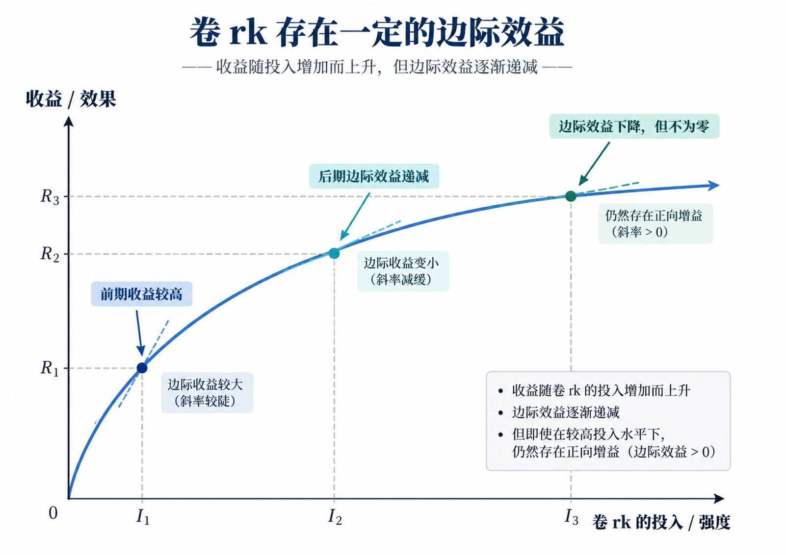

## Vince：Taste 决定 Attention，平台决定下限

主包的Background的是古早的某一级人工智能专业rk1（学习+综合，不含创新班），有幸获得屈伯川奖学金，也曾在大三侥幸发表一篇NeurIPS，最后保研到PKU读Master，现在是Incoming Ph.D@PKU，研究方向是Agentic AI、Multi-modal Generation、3DV。

***整个大学本科期间，我一直在验证一件事：我想做成功我关心的事情。***

我不想悲情主义叙事，我尽量平铺直叙地recall一下大学时期的生活，。

- 大一、我想的是保证绩点前1%+尽可能体验大学生活。在大一一年，我除了学习之外，就一直在探索课业之外的事情，学生活动、社会实践、科创等，参与了2个部门、3个社团、2次社区挂职、150小时志愿活动、运动会，最后排名成绩0.8%。

- 大二、我想的是拿奖学金1+5，得到学生标兵称号+同时开始上手接触科研+保证绩点前2。这一年是最痛苦的一年，AI的专业课难到极点，再加上两个学生工作压的我喘不过气来（但我还是感谢这两段学生工作经历让我在管理能力上得到质的飞跃）。全年做了210小时的志愿活动，参加了6个问题活动，打了快130分科创积分的比赛。做完上述所有事情之后，我在大二to大三的暑假，真正感受到力竭的感受，同样也再次评估了一下自己的能力和效率。最后在成绩方面有幸得到当年rk1，并有幸获得学生标兵称号，十佳志愿者、团员标兵的称号。

- 大三、我想的是保研外校（Top5，清北复交浙）+稳住绩点。大三我第一时间找到了张雪涛老师学无人机（当时对UAV很感兴趣），也算是第一次基础到Robotics的科研，难但是能推进，实验最后没work，最后没有文章产出，但是拿到了2个机器人国赛一等奖。而在23年2月份的时候很感谢当时好哥们邀请我加入，我和他每天自费跑实验，当时GPT还没有现在这么超模的情况下，我第一次上手了CV方面的科研，每天都在手搓轮子，5月投稿NeurIPS的时候通宵了3天，最后在9月份成功中稿。至于夏令营保研期间，从3月到6月，申请了约30个老师，8个老师给面试，3个老师给offer+1个候补offer，整体输麻了（当时可能有rk1的滤镜吧，觉得rk1勇者无敌哈哈），清华贵系候补、北大offer、sysu offer和自动化所模式识别组offer，同时我还尝试了港三的申请，当年拿下HKPFS是稳的，同时某mmlab老师也给我发了offer，但是由于北大这边先要我，我感觉北大这个老师蛮好的，我就去了。最后前三年绩点专业rk1（学习+综合，不含创新班），在9.28填好系统，感慨万千。

看似成功对吧？从结果论的角度来讲，我觉得确实蛮成功的。但rethink this progress，实则不然，对于我来说，这里面最大的败笔，其实是卷rk。卷rk是存在一定的边际效益的，卷到能拿到学习一等（我觉得3%为宜），然后把剩余的时间拿去做其他想做的事情，谈恋爱、拍照、参加活动、做科研等等，感觉会更mk sense。

但回到最开头的问题，在大学四年内，思考清楚自己想要做什么，并且尝试把它做成，我觉得就是一件很值得的事。当然，这个答案不用在大一就有。我也是参加过活动、做过学生工作、接触过科研，才慢慢知道自己对什么感兴趣、擅长什么，又愿意为什么付出时间，这些尝试都有意义。**如果重来一次，我会以同样的热情给它们多留一点空间**。

这也是我理解的Taste决定Attention：只有自己觉得什么值得，才会愿意把有限的注意力放在哪里。大学里有很多现成的评价标准，绩点、排名、奖项，每一个都能告诉你还能往前走多少。但这一步值不值得继续走（因为大学的评价体系不一定是对的，maybe只是为了用于方便管理学生），需要自己判断。有些事情暂时没有加分（大一除了学习奖学金以外，其他单项一个都没评上，当时也挺无语的，现在释然了）、没有成果，甚至不一定做得成，只要我确实关心，也值得认真花时间去试。

***到了北大，我在科研中迷茫，在生活中救赎自我，课题组给了我绝对的自由***

新的环境，让我十分不适，让我迷茫。

不适感在于落差太大、科研Taste的差距也太大。

迷茫来自于没有subgroup，感觉漂浮无根。

但转折点来自于带我的两个师兄，慢慢把我带入3DV的domain，给我很多的资源和算力，并在科研流程上给予我极大的帮助。虽然痛苦+崩溃，但是我在大四阶段，第一次完整走完了科研的全部流程：

*调研 ->  Idea打磨&讨论 ->  baseline实验 ->  实验修改、改进 ->  实验work ->  写paper、画图 ->  rebuttal ->  中稿/转投 ->  宣传工作、挂arxiv ->  出国开会、做poster*

从此以后，我的科研开始走入正轨，**但“会做科研”和“知道自己想做什么科研”**，中间还有很长一段距离。课题组给了我绝对的自由，一方面是，我不开心了可以随时回家躺着或者出去旅游，另一方面，我可以自由选择方向、安排节奏，同时也需要自己回答：这个问题为什么值得做？我是真的感兴趣，还是仅仅觉得它可能中稿？本科时，大部分目标都有明确的评价标准；**到了这里，连目标本身都需要自己去找。**我对科研Taste的理解，也是在这个过程中慢慢具体起来的。

这期间，我还带了一些大工的学弟，尝试手把手带人，也开始学习面试、筛选、管理和培养。自己做的时候，很多事情觉得理所当然，真正带人之后，才发现把事情讲清楚、判断对方卡在哪里、给出合适的帮助，也都需要学习。**一边做学生，一边尝试带学生，让我有机会从两个位置理解同一段关系。**“学生”和“老师”对指导、进度和反馈的期待，未必天然一致，需要沟通，也需要彼此体谅。我也慢慢学着把自己的期待说清楚，同时理解对方的难处，在双方想要的东西之间找到平衡。这些经历，后来都成了我自己参加面试、和老师沟通，以及实习时与mentor相处的基础。最后，带的几个学弟也都很给力，以第一作者身份中了CVPR、ICLR和T-CSVT。

至于生活，我开始允许自己的注意力从科研里分出来一点。实验不work的时候，人很容易觉得自己也不work了，但我想慢慢学会把这两件事分开。科研暂时没有进展的一天，也可以是生活过得不错的一天。这大概就是我说的“在生活中救赎自我”：给那些和paper无关、但自己同样关心的事情，留出真实的时间。

这也是标题对我最具体的意义：**平台给我资源、同伴和尝试的空间，Taste决定我把Attention放在哪里。**我很感谢一路上遇到的老师、师兄、朋友和学弟学妹们，也希望把自己得到过的帮助继续传递下去。未来还有很多东西要学、很多问题没想清楚，但最开始的那个愿望一直都在：**我想做成功我关心的事情。**

如果你也对 **Agentic+X、World Model、3DV或者Multi-modal Generation** 感兴趣，想入手科研工作，欢迎email me，一起交流想法、讨论合作，尝试做些我们都关心的事情。📮 [falcary@outlook.com](mailto:falcary@outlook.com)