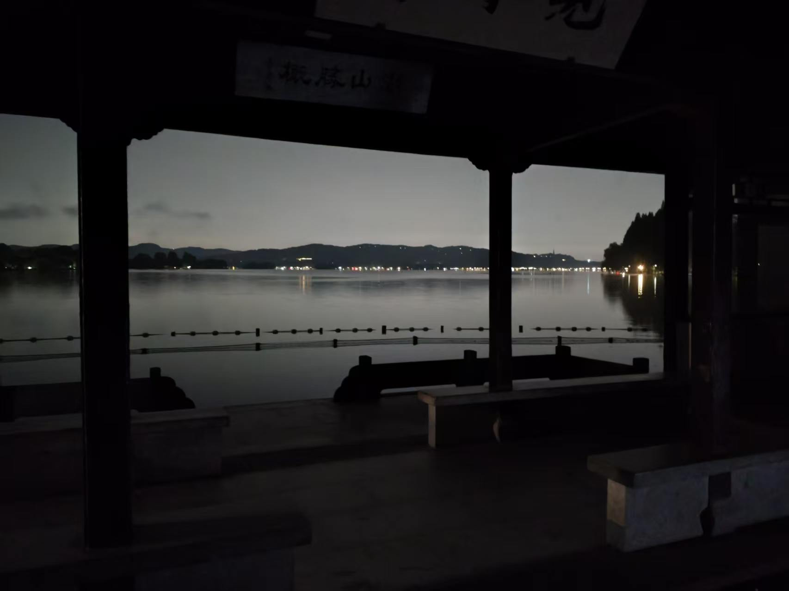

# bowen: 一条路究竟怎样

现在是 2026 年 8 月 27 号晚上 23:24 分，上海闵行区某个短租的民宿里，中元节还没有过去，我本来说晚上十点多想去一趟公司拿电脑充电线顺便干一会活的，可是因为害怕所以没出发。

tzz 已经催了我很多次让我写这个东西，我一直没有想好怎么写，恰逢明天计划回大连，一想到后面还会参加学院迎新看到很多学弟学妹入学的样子，我决定还是在此前把这边写好。

其实完全没有想好要写什么，但其实我们不必完美主义，那么就从确定的自我介绍开始吧。

## 自我介绍（保研向）

我是刘博文，大连理工大学未来技术学院 2023 级本科室，专业绩点排名 7/64(很大程度上是因为思政课分数都太低了，大家一定要注意思政课成绩) ，综合排名 1/64。曾任大连理工大学算法竞赛集训队队长，获得 ICPC/CCPC 邀请赛金牌合计4块、区域赛银牌合计3块。CCF CSP 455 ，雅思 7.0。有一篇 ECCV2026 第二作者，一篇 AAAI2026 共一在投，一块 kaggle 银牌(全国第二)。

如果大家很在意保研的话，经验证，我这个 bg 今年能去绝大部分华五，清北需要冲一冲，大约定位就在华五强组上下。大约大半年之前，我都在担忧自己能不能稳上几个比较出名的中九，连续几周经常失眠到三四点。当然我至今也没有办法说某些学校我想去就能去或者某些夏令营我随便入，但是现在看来前面好多时间都浪费在过度焦虑了。

> 很多时候焦虑不能改变任何问题，专心做好自己的事情才是最重要的，我现在认为绝大部分场合下都能专注在自己身上不被外界打扰是很重要的能力，这是我 ZJU 一位师兄跟我讲的，我至今感谢他愿意听我发牢骚。

## 模糊的流水账

我的大学前三年大概是这样子：

 - 大一刚入学就加入了 ACM 集训队并十月份就拿到了 ICPC 区域赛（南京站）的资格，因为我是新生赛第一名。后面 ICPC 区域赛艰难拿到了铜牌。

 - 大一到大二基本全程 ALL IN 算法竞赛，算是 dlut 当时最刻苦的几个人之一，后面水平明显提升，大二秋季学期的时候和好队友拿到了第一块 ICPC 区域赛银牌。其实这个时候我能加在保研综测的科创积分就早就满了，但是当然了我超级热爱算法竞赛，从来没想过自己打比赛是为了这个保研或者奖学金，只是想拿金牌，于是仍然在接着打。

 - 同样是大二秋季学期遇到带我科研入门的恩师张平平老师，张老师人很好，我们大约聊了几次，后面我在第二年的春节前后确认想跟张老师做科研&学习。

 - 我很区，根本没有办法兼容两边的事情。我的水平需要高强度训练才能支持我打出成绩并更进一步（拿到金牌），竞赛和科研同时推进几乎要把我撕碎了。最忙的几个月每周末都在外面打比赛，然后回学校就要汇报实验进展，有时候还要在路上汇报，很经常地需要带着电脑随时随地工作。“人应该聚焦” 这件事真的很重要。

 - 大约大二下学期的暑假，在张老师手下做出了一小点成果，遇到了一个跟 thu 某组合作的机会，我直接加入了。

 - 大三上半学期，CVPR 投稿 和 ICPC 完全冲突了，我当时同时兼职张老师手下的科研、ICPC训练以及清华合作，度过了一段比较痛苦的时间。后面 ICPC 仍然是银牌，我们当时评价自己距离金牌其实没有特别远，甚至只差一些运气，可惜我已经老了，而且也没有精力去痛苦。同时 CVPR 也没有中，甚至拿了一个很低的分数，张老师那边后面的工作也没有产出，这就是我的大三上学期。

 - 大三下学期算法竞赛完全退役，开始焦虑地保研，经常失眠到三四点睡不着。同时间转投的 ECCV 有幸拿到了 444 ，不意外地中了，至此我认为我的 bg 积累到一个还算可以的境地————但是当时我已经拿到了十分满意的 offer ，曾一度认为所有事都已经结束了。

 - 再往后又经历了不少事情，前面很多事也是一笔略过，不再一件件在这里说。大家一路走来都不容易，有时候私下里都会喝点酒互相倾诉然后抱头痛哭。

## 所以一条路究竟怎样

> 如果一定要给一个评价的话，我会顾左右而言他地说我非常不建议大家为了保研、大厂或者别的一些目标而变成空心人。抛开内卷之后能健康生活的能力十分重要，鉴于高保研率带来的鲁棒性，建议大家先不要太急于卷保研，而是首先享受生活。

现在是 2026 年 8 月 29 日凌晨 3:22 ，我刚从上海回到大连，因为白天的机票太贵所以买了半夜的春秋航空，还因为行李尺寸又额外被坑了 150 块。这会终于安顿下来，于是接着动笔写一点这边的东西。

真是感叹，我依稀记得自己高三的时候还是文思泉涌的，当时觉得自己的散文清逸俊秀十分有才。可惜现在变成了狗嘴吐不出象牙，除了一些技术性的文字，已经丧失绝大部分写作能力了，一提到写东西大脑就卡卡的不知道要说什么。所以保研给人带来了什么、优绩主义给人带来了什么，为什么现在面对有些事情我的第一反应是这东西不加综测分所以没有用，其实我们一直在反思。

昨天晚上在上海偶然认识了一个同济的兄弟，也是算法竞赛出身，主要在做 sys 方向的一些工作。比较惊讶的是我俩发现自己同时在大二的时候被人劝说尽快退役，趁早专注科研，”当时肯定是没办法理解，但现在看来这真是对的。“或许这就是我们都要经历的过程吧。我回顾本科这两年，绝大部分痛苦的时刻基本都是同时并行好几个工作导致的。现在想来比较幸福的状态确实就是找到自己喜欢的方向然后专注地做下去，专注自己，心无旁骛，如果本科重来一遍我会希望自己更偏向于成为这样的人。

所以一条路究竟怎样，感觉这种问题一直很难说。上面一段里我给出的答案是“找到喜欢的方向然后专注地做下去”，但是本科生到底怎样能找到真正喜欢的方向，专注在某个脱离时代的小领域导致与时代脱轨到底是不是好的选择，是不是所有人都适合专精在某件事情上，其实这些问题都没有确切的解。原谅我自己也没有活得很明白，只能大约地说一直坚持迭代总归是好的。接到【某个学校】夏令营入营通知的那个晚上我在杭州，心里很不痛快，看不清命运到底把我引向哪里，也不知道自己要做什么，决定凌晨两点去西湖骑车。当时心烦意乱也不想开导航，几度骑进岔路找不到方向，但是最后也大约骑了一圈多并成功找到路。那天真的是杭州连续高温之后难得凉爽的几个小时，凌晨四点的时候我决定放弃等待日出而直接返回酒店。并不是西湖的日出不好看，而是我隐隐地想到了一件事，世界上路有很多条、漂亮的风景很多种，走一段岔路、错过一次日出，都没什么大不了的，既然我十分疲惫那我就去休息。错过日出不意味着我不做攻略不开导航走的路线就是错的，明天起床我仍然在路上。

(上图为 2026.7.19 3:00 西湖实拍，毫无技术还请见谅)

不得不感叹我这文笔已经距离中学时期差得太远了，如今已经是苍苍老矣，不似人类，实在感谢还能看到这里的同学，但无论如何希望能给大家一小点启示。如有科研合作、讨论人生、恋爱烦恼、保研咨询&帮助、算法竞赛同好、美术交流、篮球切磋、五排开黑、八卦分享，欢迎找老学长聊天。
